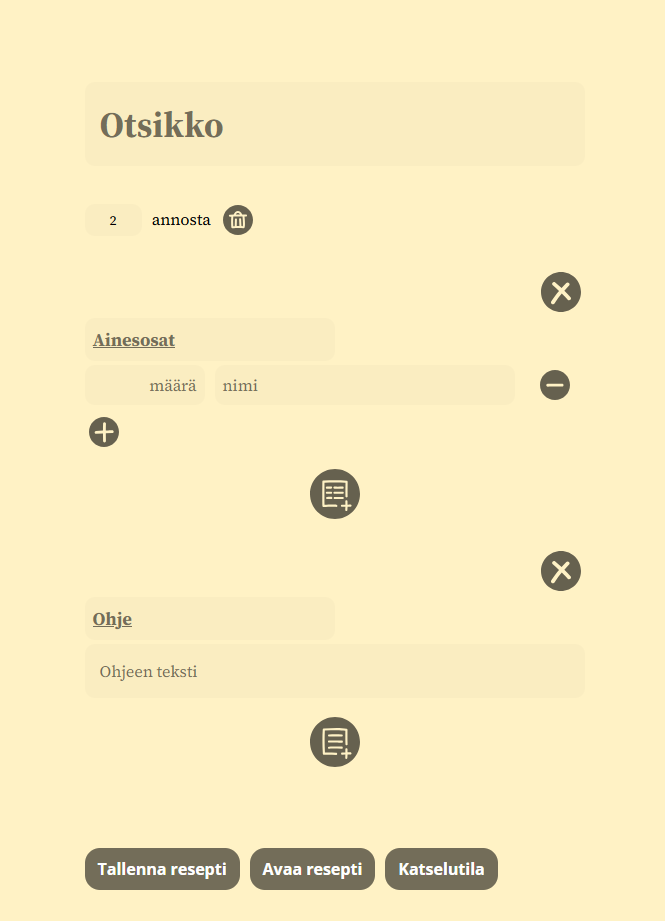
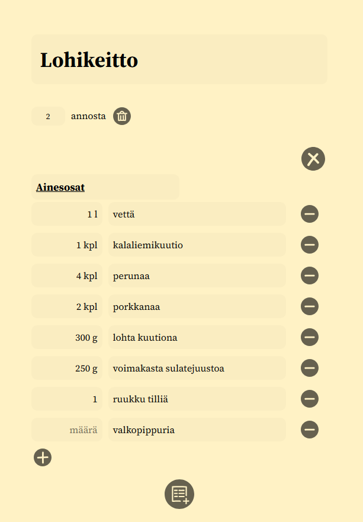
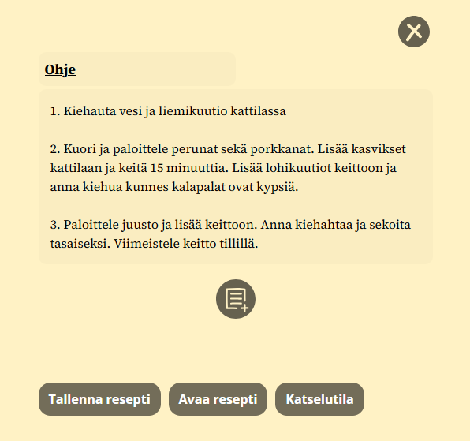
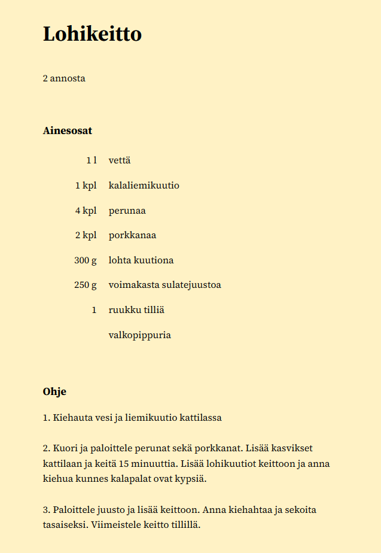

# Recipe Form

I mainly made Recipe Form to learn front-end web dev and React Native. The app is designed to be used as the recipe item is being made, so that it would be easy to write down all ingredients and instructions for the recipe.

## Features

- Ingredient lists for adding ingredients and their sizes.
- Instruction field for instructions or general text.
- Creation of multiple ingredient lists and instruction fields for organization of the recipe.
- Setting the servings of a recipe.
- Saving the recipe as a JSON file.
- Loading the recipe from a previously saved JSON file.
- Viewing the recipe as a plain recipe without the editing UI.

## Showcase

### Initial View

### Filled Recipe

### Ready Instructions

### Recipe View

